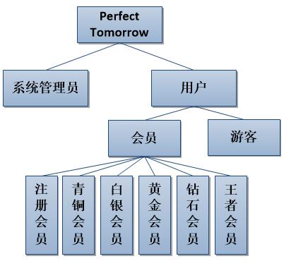
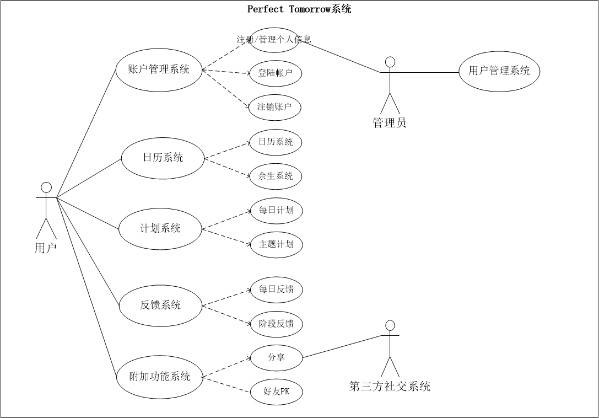
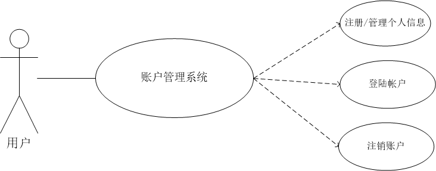
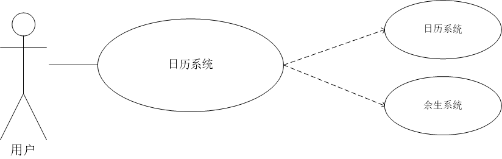
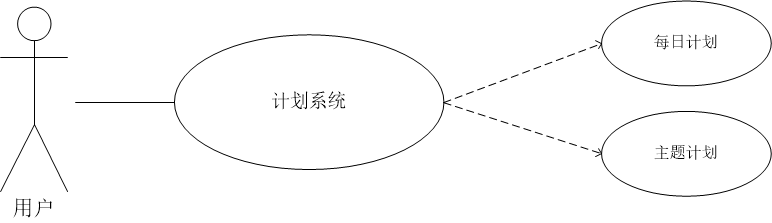
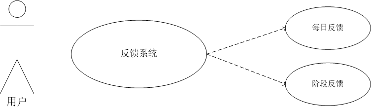
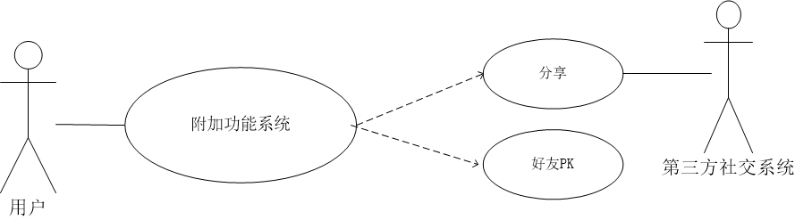
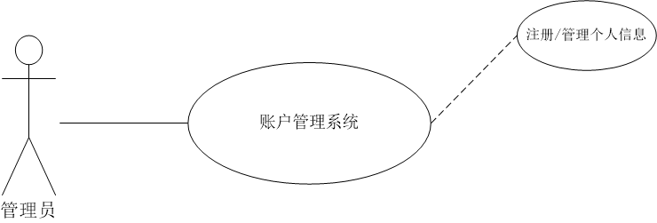
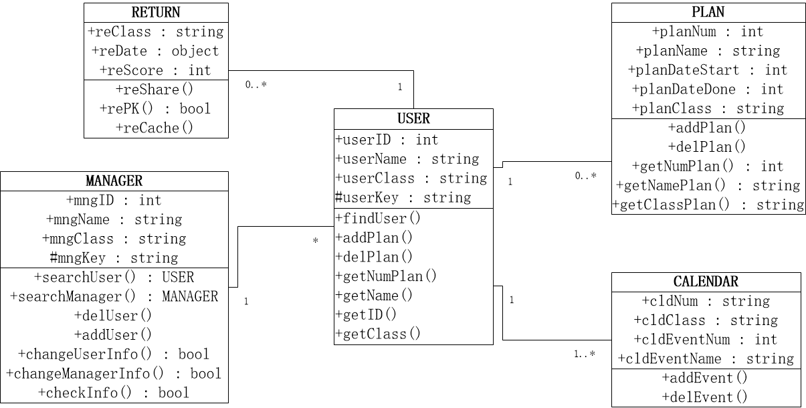

# 目录

# Perfect Tomorrow	
# 1 绪论	
# 2 系统需求分析	
## 2.1 用户组织机构描述	
### 2.1.1 用户组织结构描述	
### 2.1.2 用户职能分析	
## 2.2系统软硬件需求、存储需求、信息处理需求等	
### 2.2.1系统软硬件需求	
### 2.2.2系统存储需求	
### 2.2.3系统信息处理需求	
## 2.3总体安全与完整性要求	
### 2.3.1 用户管理	
### 2.3.2数据管理	
### 2.2.3 数据一致性	
# 3 系统概要设计
## 3.3 系统UML描述
### 3.3.1 系统用例关系图
### 3.3.2 系统用例详细描述
### 3.3.3 系统业务类图

# 等待队友添加~~~~~

# Perfect Tomorrow
# 1 绪论
在管理学中，管理过程由四个重要的部分组成，即计划、组织、领导、控制四大职能。在这里，计划具有两重含义，其一是计划工作，是指根据对组织外部环境与内部条件的分析，提出在未来一定时期内要达到的目标以及实现目标的方案途径。其二是计划形式，是指用文字和指标等形式所表述在未来一定时期内关于行动方向、内容和方式安排的管理事件。在管理实践中，计划是其他管理职能的前提和基础，并且还渗透到其他管理职能之中，列宁指出过：“任何计划都是尺度、准则、灯塔、路标。” 它是管理过程的中心环节，因此，计划在管理活动中具有特殊重要的地位和作用。

在经济日益发展、生活频率和节奏越发快的21世纪，事务繁忙常常容易让人们忘记所需要去做的事情。拖延症也常常困扰着人们的生活。拖延症是指自我调节失败，在能够预料后果有害的情况下，仍然把计划要做的事情往后推迟的一种行为。拖延是一种普遍存在的现象，一项调查显示大约75%的大学生认为自己有时拖延，50%认为自己一直拖延。严重的拖延症会对个体的身心健康带来消极影响，如出现强烈的自责情绪、负罪感，不断的自我否定、贬低，并伴有焦虑症、抑郁症等心理疾病，一旦出现这种状态，需要引起重视。

为了更好的对自己的时间做出把控，让生活更有条理，提高自身的执行力，积极抵抗拖延给我们生活带来的不良影响。人们在日常生活中常常会选择对事情做出计划，这样事情才能够得到有条理的解决。Perfect Tomorrow 这一款软件正是基于这样的背景下被我们团队提出来梳理、管理人们的生活，对明天做出一个有序可执行的计划，每天自省，提高自身的效能感、造就更加美好的明天。

通过Perfect Tomorrow，人们可以对时间有更好的掌握力，简单日历功能能够让你轻易了解时间的变化，备注下每一个你爱的人的生日或是有意义的纪念日；其附加功能可以用一张表格来显示你已经逝去的时间（比如说，你20岁了，那么你就大概活了251个月，如果活到75岁，那么还剩下649个月）。除开简单便捷的日历功能，Perfect Tomorrow当然可以为你提供明天一天计划制定服务，今晚对今天任务的执行力选上 to do（未做）/done（已做），未做的事情是不是需要顺延到明天继续。主题备忘功能让你铭记自己立下的flag，例如：新年flag、想读30本书、想和发小一起做的10件事，再也不会出现flag倒下的状况了！在做计划、完成计划之后，还有一个反馈机制让你及时了解自己的执行力情况，据此调整自身的学习、工作、生活状态。除此之外，好友和分享功能都可以让你看到周围圈子人执行力情况，旨在帮助你找到一个执行力爆表的伙伴一起进步，所以通过Perfect Tomorrow约上执行力百分百的学霸一起开启学习模式吧。

# 2 系统需求分析
## 2.1 用户组织机构描述
### 2.1.1 用户组织结构描述
Perfect Tomorrow系统涉及到系统管理员和用户两个部分，其组织机构图如图2-1所示。

#### 图2-1 Perfect Tomorrow系统-用户组织结构图
### 2.1.2 用户职能分析
（1）系统管理员：Perfect Tomorrow系统服务器的操作者。主要职能包括用户管理、增值服务管理、数据库信息管理等。

（2）旅客：网站注册用户和未注册的游客。
非注册用户在首次使用时进行实名注册成为会员，也可以在未注册的情况下进行系统界面的浏览。

注册用户可以通过登录自己的账户进行个人信息的查询、日历查询、备注以及做计划，通过积分、累加计划日数等享受一系列优惠服务。注册用户按照积分数目可划分为注册会员、青铜会员、白银会员、黄金会员、钻石会员、王者会员。积分的获得可以通过购买系统经典计划、完成个人计划、参加相关活动、好友分享等途径。

注册会员：注册成功即成为注册会员。  
青铜会员：累计积分大于500即成为青铜会员。  
白银会员：累计积分大于2000即成为白银会员。  
黄金会员：累计积分大于5000即成为黄金会员。  
钻石会员：累计积分大于10000即成为钻石会员。  
王者会员：累计积分大于20000即成为王者会员。

不同级别的会员享受不同的会员特权和定期的优惠活动，还有积分兑换等活动。
## 2.2系统软硬件需求、存储需求、信息处理需求等
### 2.2.1系统软硬件需求   
机票预定系统中的各个子系统的硬件和软件的配置如下：  
（1）服务器端子系统的运行要求：
    系统软件： Windows
    数据库管理系统：SQL Server 2005
    硬件要求：Pentium III 450以上, 256M RAM,  14G HD  

（2）客户端子系统的运行要求：
    系统软件： Window xp
    数据库管理系统：SQL Server 2005
    硬件要求：Pentium 133以上,  32M RAM,   4.3G HD  

（3）软件属性需求
     在数据检索、数据增删改方面必须做到丝毫不差，满足软件开发的正确性要求。必须考虑充足的异常处理机制以及软件的复用性，以便增强软件的健壮性。在安全保密性方面做到不同身份所能处理的事务不同，避免保密数据泄漏；设置足够的触发器对不安全的数据修改进行回滚操作，进而保证了安全性要求。所开发出来的软件必须是可维护的。  
### 2.2.2系统存储需求
（1）大容量 
    随着用户数量和业务数量的快速增长，Perfect Tomorrow系统的数据量也会存在爆炸性增长的可能，数据总量呈指数上升，Perfect Tomorrow存储系统必须具有足够的容量以适应不断增长的数据量。存储系统不光要有大量的现实容量，还应该具有很好的可扩展性，能根据数据量的增长提供无缝的、不停机的容量扩充。  

（2）高性能
    信息是具有时效性的，及时获得所需数据非常关键；对于Perfect Tomorrow系统而言，较高的访问速度是服务质量的重要指标。对于宽带应用，存储系统的带宽要与网络带宽相适应。因此，存储系统的响应速度和吞吐率是存储系统应该密切关注的问题。因此，要提高数据中心存储系统的整体性能，存储系统的性能提高是一个关键问题。  
（3）高可用性
    数据中心存储系统存储了企业大量的关键数据，因此，必须保证这些数据始终是安全可用的。在任何情况下，例如系统产生错误或遇到意外灾难，数据都不能丢失。系统应具有快速故障恢复能力，保证应用系统永不停机（7×24小时不间断工作），数据始终保持完整性和一致性。  
（4）可管理性  
数据中心存储系统保存着大量的业务数据。对这些数据的管理不光体现在应用层的管理，还体现在存储系统的管理。这主要表现在集中的自动化管理，如数据按特定规则的备份、对系统性能和流量等特性的监测、存储设备的负载平衡等。 

2.2.3系统信息处理需求  

Perfect Tomorrow系统的信息处理需求包括如下几点：

（1）数据录入和处理的准确性和实时性
    数据的输入是否准确是数据处理的前提，错误的输入会导致系统输出的不正确和不可用，从而使系统的工作失去意义。数据的输入来源是手工输入。手工输入要通过系统界面上的安排系统具有容错性，并且对操作人员要进行系统的培训。
	 在系统中，数据的输入往往是大量的，因此系统要有一定的处理能力，以保证迅速的处理数据。

（2）数据的一致性与完整性
    由于系统的数据是共享的，在不同的子系统中，执行力榜单是共享数据，所以如何保证这些数据的一致性，是系统必须解决的问题。要解决这一问题，要有一定的人员维护数据的一致性，在数据录入处控制数据的去向，并且要求对数据库的数据完整性进行严格的约束。
    对于输入的数据，要为其定义完整性规则，如果不能符合完整性约束，系统应该拒绝该数据。

 （3）数据的共享与独立性
    整个Perfect Tomorrow系统的数据是共享的。然而，从系统开发的角度上看，共享会给设计和调试带来困难。因此，应该提供灵活的配置，使各个分系统能够独立运行，而通过人工干预的手段进行系统数据的交换。这样，也能提供系统的强壮性。

## 2.3总体安全与完整性要求
一个成功的Perfect Tomorrow系统在系统需要满足用户管理、数据管理、数据一致性等方面要求。
### 2.3.1 用户管理
对于用户管理方面，系统在需要满足用户需求的同时也要对用户的安全提供保障。用户可以直接登录网站查看个人信息但用户需要操作时需要用户实名认证并且设置6-14位密码保证用户的安全；实名认证是为了保证用户的唯一性以及操作可保存性。密码设置最低位数为6为提高了密码的安全性，密码可以为数字、字母、标点符号等并且密码要求不能只为数字和不允许有空格。在密码设置时，系统会自动显示你的密码安全级别；密码设置一共有三个等级：第一级表示你的密码还不是太安全；第二级表示您的密码安全性已经比较高了；第三级密码表示您的密码特别安全不易破解。关于密码设置的位数问题：由于一个数字或字母或标点符号在计算机中占有8位并且以0或1存储则6位数的则在计算机中有2的48次方的储存可能，要想破解此密码还是比较困难的。
### 2.3.2数据管理
数据管理方面：系统会保证用户数据的保密性、完整性、可靠性。保密性：机密或敏感数据库在存储过程、处理、传输过程中要保密，确保用户在授权后才能访问；完整性：保证系统中的信息处在一种完整和没有受到损害，防止因非授权访问、部件故障或其它错误而引起信息篡改、破坏或丢失。同时系统管理员注册用户只能对自己的数据库进行管理；可靠性 ：保障系统在复杂的网络环境下提供持续、可靠的服务。此外网站会提供事务并发处理并且采取一定的措施：当多个用户同时更新同一数据的时候，由于更新可能导致数据的不一致性，使得程序的业务数据发生错误，这种情况可以称之为并发。并发的处理可以通过三种方式来控制：保守式并发控制、开发式并发控制以及最后更新生效方式。  

保守式并发控制：数据从数据库取出之后，一直处于锁定的状态，其他用户不能获取该数据，直至数据更新完毕之后，用户才能取出该数据进行操作。此种控制方式对于性能和资源占用得很多，由于只能同时有一个用户对数据享用操作权，所以可能会在正常业务中，影响其他用户的处理进程。但此控制方式可以完全保证数据的完整性。该方式可以通过.NET提供的事务机制来实现，前提是数据源需要支持事务。 
 
开发式并发控制：数据在更新之前都是可以被其他用户使用的，只有在更新的时候，才锁定记录。但更新的时候，会比对与查询之初的数据是否吻合，如果不一致，则不运行修改。此种控制方式也可以完全保证数据的完整性，其优点是不会占用其他用户访问该数据的权限，其缺点是由于其他用户可能已经更新了这些数据，导致本次更新可能不会完成。对于此种控制方式，多以开发人员通过程序本身的业务逻辑来实现。  

最后更新生效方式：此种方式同上，只有在数据更新的时候，其他用户才不可使用，但更新的时候不检查是否与开始数据一致，而直接对其更新。此种方式对于更新的并发性有很大的支持，但缺点是可能引发前后数据的不一致。此种方式适合可以满足此需求的业务场景使用。  

SQL 程序员要负责启动和结束事务，同时强制保持数据的逻辑一致性。程序员必须定义数据修改的顺序，使数据相对于其组织的业务规则保持一致。程序员将这些修改语句包括到一个事务中，使 SQL Server 2005 数据库引擎 能够强制该事务的物理完整性。
企业数据库系统有责任提供一种机制，保证每个事务的物理完整性。数据库引擎提供：锁定设备，使事务保持隔离。

记录设备，保证事务的持久性。即使服务器硬件、操作系统或数据库引擎 实例自身出现故障，该实例也可以在重新启动时使用事务日志，将所有未完成的事务自动地回滚到系统出现故障的点。

事务管理特性，强制保持事务的原子性和一致性。事务启动之后，就必须成功完成，否则数据库引擎 实例将撤消该事务启动之后对数据所做的所有修改。

### 2.2.3 数据一致性
所谓数据一致性，就是当多个用户试图同时访问一个数据库，它们的事务同时使用相同的数据时，可能会发生以下四种情况：丢失更新、读错数据、不可重复读等问题；数据一致性通常也指关联数据之间的逻辑关系是否正确和完整。而数据存储的一致性模型则可以认为是存储系统和数据使用者之间的一种约定。如果使用者遵循这种约定，则可以得到系统所承诺的访问结果；而事务在完成时，必须使所有的数据都保持一致状态这样有利于确保多用户访问同一数据库时候数据的保真，统一，同时也便于数据库对其数据的管理。同时网站在设计时也会设置专门的文件夹用于存储信息，管理员会定期处理进行数据备份。
# 3 系统概要设计
## 3.3 系统UML描述
### 3.3.1 系统用例关系图

##### 图注：系统与子系统之间的均为包含关系，<< include >>字样略（下同）

#### 图3-3-1 Perfect Tomorrow系统用例图
### 3.3.2 系统用例详细描述
一. 用户操作部分

（1）账户管理系统

#### 图3-3-2 账户管理系统用例图
#### 表3-3-1 账户管理系统用例说明
|用例：用户账户管理 |
|---------|
|ID：UC01 |
|简单描述：用户管理自己的账户，包括注册/登录、管理个人信息、注销账户|
|前置条件：无|
|基本事件流：1.进入Perfect Tomorrow系统。2.第一次使用该系统，则需填写个人信息进行注册。3.填写用户信息登录系统。4.如需更改个人信息则点击相应按钮进行更改。5.确定不再使用该系统可选择注销账户，同时删除所有与其相关数据。|
|后置条件：无 |
|备选事件流：1.如果用户输入的注册信息有误则让用户重新输入。2.如果用户输入的登录信息有误则需让用户重新输入|

（2）日历系统

#### 图3-3-3  日历系统用例图
#### 表3-3-2  日历系统用例说明
|用例：日历系统|
-----|
|ID：UC02|
|简单描述：普通日历系统用于完成普通电子日历功能（记录事件、查看日期等），余生系统用于显示用户的一生还剩多少个月|
|前置条件：无|
|基本事件流：1. 用户进入日历系统之后可进行查看日期、记录未来事件等；2. 用户可进入余生系统查看自己的余生信息|
|后置条件：无|
|备选事件流：无|

（3）计划系统

#### 图3-3-4  计划系统用例图
#### 表3-3-3  计划系统用例说明
|用例：计划系统|
-----|
|ID：UC03|
|简单描述：用户可以编辑每日计划和主题计划|
|前置条件：无|
|基本事件流：1.	用户进入每日计划根据时间线来编辑计划，编辑完成后点击确认；2.	用户每完成一项计划可在对应计划条目下打勾；3.	用户可进入主题计划系统选择备选主题的计划或根据自身需要进行自定义，定义完成后点击确认；4.	重复步骤2|
|后置条件：无|
|备选事件流：1.	如果用户不能在规定时间内完成主题计划，则计划过期立即删除计划；2.	如果用户在规定时间内完成所有计划则将该计划列入“已完成”列表|

（4）反馈系统

#### 图3-3-5  反馈系统用例图
#### 表3-3-4  反馈系统用例说明
|用例：反馈系统|
----|
|ID：UC04|
|简单描述：用户可以查看自己的执行力（每日）反馈和阶段执行力反馈|
|前置条件：无|
|基本事件流：1.用户登录反馈系统查看自己的每日反馈情况和阶段性反馈情况|
|后置条件：无|
|备选事件流：无|

（5）附加功能

#### 图3-3-6  附加功能系统用例图
#### 表3-3-5  附加功能系统用例说明
|用例：附加功能|
-------|
|ID：UC05|
|简单描述：1.	用户可以分享自己的反馈结果和计划给第三方社交平台的其他用户；2.	用户可以添加好友，并与好友PK执行力|
|前置条件：无|
|基本事件流：1.	用户在计划系统或反馈系统内通过分享按钮进入分享功能系统。2.	用户选择第三方社交平台将自己的信息分享给好友。3.	用户可以通过查找功能添加好友4.	用户可以选择已添加好友与其进行执行力PK|
|后置条件：无|
|备选事件流：1.	若用户账号内并无好友，则无法使用好友PK 功能|

二.管理员控制部分

（1）审核账户信息

#### 图3-3-7  审核信息系统用例图
#### 表3-3-6  审核信息系统用例说明
|用例：审核账户信息|
--|
|ID：MC01|
|简单描述：当用户注册或修改信息时，一些信息需要经过管理员审核|
|前置条件：无|
|基本事件流：1.	当管理员接收到用户提交的重要信息时需经过人工审核，管理员点击审核并查看该用户相关信息；2.	审核通过则点击通过；3.	不通过则点击不通过，并选择不通过原因反馈给用户|
|后置条件：如果用户身份信息核实不通过，则对该用户账号进行处理|
|备选事件流：无|

（2）用户管理系统

#### 图3-3-8  用户管理系统用例图
#### 表3-3-7  用户管理系统用例说明
|用例：用户管理系统|
----|
|ID：MC02|
|简单描述：管理员可以实现对用户信息的增、删、改、查|
|前置条件：无|
|基本事件流：1.	管理员进入用户管理系统，输入需要进行操作的用户ID；2.	管理员可以查看、修改该用户的部分信息；3.	管理员可以增加或删除某个用户的信息|
|后置条件：无|
|备选事件流：无|

### 3.3.3 系统业务类图

#### 图3-3-9 Perfect Tomorrow系统类图
#### 表3-3-8 Perfect Tomorrow系统类图说明
|类名|	属性|	操作|
|--|--|--|
|USER 用户类	|用户ID、用户名、用户类别（会员级别）、用户密码|	查找其他用户、添加计划、删除计划、获取计划编号、获取姓名、获取ID、获取用户类别|
|MANAGER 系统管理员类|	管理员ID、管理员姓名、管理员类别、管理员密码|	查找用户、查找其他管理员、删除用户、添加用户、更改用户信息、更改管理员信息、审核用户信息|
|PLAN 计划类|	计划编号、计划名、计划开始日期、计划结束日期、计划类型|	添加计划、删除计划、获取计划编号、获取计划名、获取计划类型|
|CALENDAR 日历类|	日历编号、日历类型、日历事件编号、日历事件名|	添加事件、删除事件|
|RETURN 反馈类|	反馈类型、反馈日期、反馈评分|	分享反馈结果、反馈结果PK、保存反馈结果|
